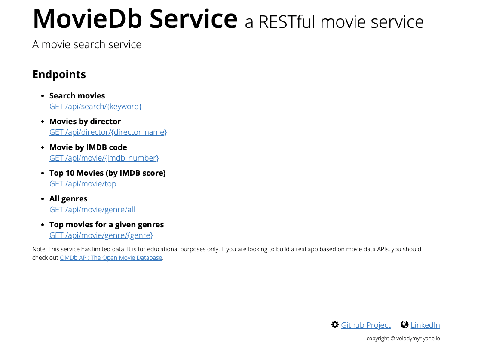

# Movie search API
A lightweight movie search API written in [_responder_](http://python-responder.org/en/latest/) python HTTP service framework.

[](https://travis-ci.org/vyahello/movie-search-api)
[](https://coveralls.io/github/vyahello/movie-search-api?branch=master)


## Table of contents
- [Run application](#run-application)
- [Contributing](#contributing)

# Run application
Run script from the root directory of the project:
```bash
python search.py
```

# Demo


# Contributing
- clone the repository
- configure Git for the first time after cloning with your name and email
  ```bash
  git config --local user.name "Volodymyr Yahello"
  git config --local user.email "vyahello@gmail.com"
  ```
- `python3.6 +` is required to run the code
- `pip install -r requirements` to install all project dependencies
